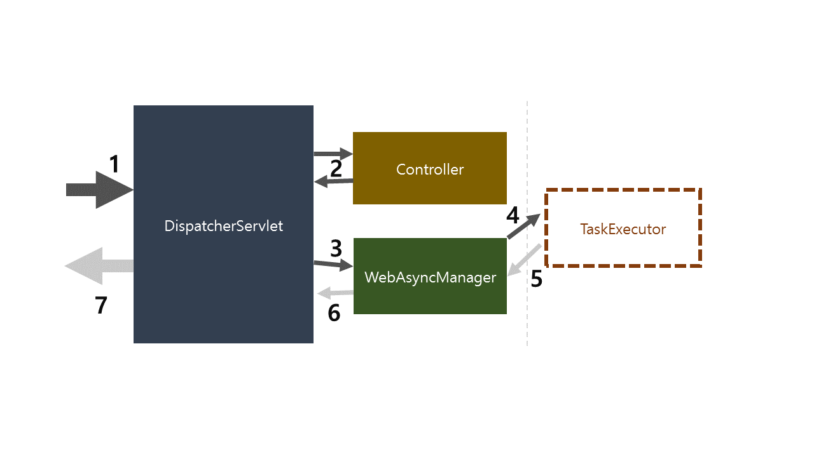

# Async Controller
Spring으로 들어오는 Request를 비동기로 처리하여 돌려주는 방법
Spring MVC 3.2부터 추가됨

## Callable
### 예제
``` java
@RestController
public class AsyncController {
  @Autowired
  AsyncService asyncService;

  @RequestMapping(method=RequestMethod.GET, path="/tests")
  public Callable<List<String>> readTests() {
    return asyncService::getTests;
  }
}
```
1. Callable을 return
2. Callable 작업이 모두 처리되면 결과값이 Response로 돌려줌

### 내부 동작

1. Request가 들어옴
2. DispatcherServlet가 해당 path에 알맞는 Controller method를 찾아 요청하고, Callable을 돌려받음
3. DispatcherServlet은 Callable을 비동기 처리하도록 WebAsyncManager에 요청함
4. WebAsyncManager는 Callable을 특정 TaskExecutor에 할당하여 비동기 처리
5. Callable의 작업이 완료되면 WebAsyncManager로 결과값을 돌려줌
6. WebAsyncManager는 DispathcerServlet에게 dispatch 요청
7. DispatcherServlet은 WebAsyncManager에게서 결과값을 받은 다음 적절하게 처리하여 Response를 돌려줌

### 유의점
- Callable은 기본적으로 SimpleAsyncTaskExecutor에서 실행됨
  - Production에선 환경에 알맞게 AsyncTaskExecutor을 세팅할 필요성이 있음
  - Callable을 사용하면서 AsyncTaskExecutor을 바꾸기 위해선 RequestMappingHandlerAdapter을 직접 바꾸는 방법밖에 없음

## DeferredResult
### 예제
``` java
@RestController
public class AsyncController {
  @Autowired
  AsyncService asyncService;

  @RequestMapping(method=RequestMethod.GET, path="/tests")
  public DeferredResult<List<String>> readTests() {
    final DeferredResult<List<String>> result = new DeferredResult<>();
    asyncService.getTestsEventually(result);

    return result;
  }
}
```
``` java
@Service
public class AsyncService {
  private static Logger logger = LoggerFactory.getLogger(AsyncService.class);
  private static final String TEST_STRING = "test";
  private List<String> testRepository;

  public AsyncService() {
    testRepository = new ArrayList<>();
    for (int i = 0; i < 5; i++) {
      testRepository.add(TEST_STRING + i);
    }
  }

  @Async
  public void getTestsEventually(final DeferredResult<List<String>> deferredResult) {
    if (logger.isDebugEnabled()) {
      logger.debug("return test list");
    }

    deferredResult.setResult(testRepository);
  }
}
```
1. DeferredResult를 만들어서 return
2. 비동기 작업을 처리하고나서 직접 DeferredResult 객체에 DeferredResult.setResult()로 결과값을 넘겨주면 Response로 돌려줌

## WebAsyncTask
``` java
@RestController
public class AsyncController {
  @Autowired
  AsyncService asyncService;

  @RequestMapping(method=RequestMethod.GET, path="/tests")
  public WebAsyncTask<List<String>> readTestList() {
    return new WebAsyncTask<>(null, "asyncTaskExecutor", asyncService::getTests);
  }
}
```
- Callable을 돌려줄 때와 사용법 및 내부 동작은 동일. Callable을 WebAsyncTask로 한번 더 감싸주기만 하면 됨.
- Callable에 비해서 Timeout, Task Executor 설정이 쉬운게 차별점

## Exceptions
- Callable 내부에서 발생한 Exception도 HandlerExceptionResolver에 의해서 처리가 되므로 똑같이 @ExceptionHandler을 사용하면 됨
- 
## Interceptor
- HandlerInterceptor의 postHandle, afterCompletion은 비동기 작업이 모두 끝나고 호출됨. 대신에 AsyncHandlerInterceptor 인터페이스의 afterConcurrentHandlingStarted 메소드를 구현하여 사용할 수 있음