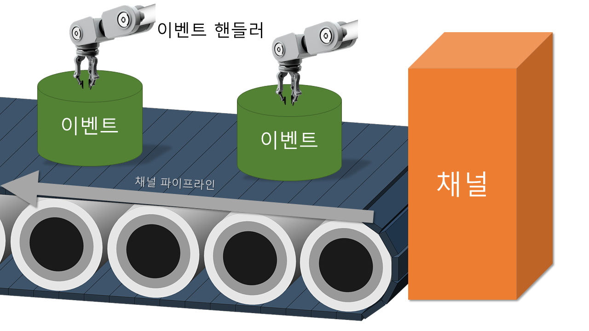

# 채널 파이프라인, 코덱
## 이벤트 실행
데이터를 처리하는 입출력은 Netty가 이벤트로 관리하기 때문에 이벤트 핸들러만 구현하면 됨

### 소켓 채널 데이터 수신
1. Netty 이벤트 루프가 채널 파이프라인에 등록된 이벤트 핸들러를 가져옴
2. 이벤트 메서드가 구현되어있으면 실행
3. 마지막 이벤트 핸들러에 도달할 때까지 다음 이벤트 핸들러를 가져와서 1, 2 반복

## 채널 파이프 라인
### 구조


### 사용법
``` java
    bootstrap = new ServerBootstrap();
    bootstrap.group(bossGroup, workerGroup)
        .channel(NioServerSocketChannel.class)
        .handler(new LoggingHandler(LogLevel.INFO))
        .childHandler(new ChannelInitializer<SocketChannel>() { // 1
          @Override
          protected void initChannel(SocketChannel socketChannel) throws Exception { // 2
            ChannelPipeline pipeline = socketChannel.pipeline(); // 3
            pipeline.addLast(new LoggingHandler(LogLevel.INFO)); // 4
            pipeline.addLast(new EchoServerHandler()); // 4
          }
        });
```
1. childHandler 메소드를 통해서 설정
2. initChannel은 클라이언트 소켓 채널이 생성될 때 호출됨
3. Netty 내부에서 할당한 빈 채널 파이프라인 가져오기
4. 파이프라인에 이벤트 핸들러 등록

### 초기화 순서
1. 클라이언트가 접속 요청
2. 해당 연결에 대응하는 소켓 채널 객체 생성
3. 빈 채널 파이프라인 객체 생성, 소켓 채널에 할당
4. 소켓 채널에 등록된 ChannelInitalizer 객체를 가져와서 initChannel 호출
5. 소켓 채널에 할당되어있는 파이프라인을 가져와서 이벤트 핸들러 등록

## 이벤트 핸들러
Netty는 Future 패턴과 Reactor 패턴 두 가지 비동기 호출 패턴을 지원

### 채널 인바운드 이벤트
- 연결 상대가 어떤 동작을 취했을 때 발생하는 이벤트
- 채널 활성화, 데이터 수신 등


**이벤트 순서**
1. channelRegistered
  - 채널이 이벤트루프에 등록되었을 때
  - 서버는 최초 서버 소켓 채널 등록, 클라이언트 소켓 채널 등록 두 가지 발생 시점 존재
  - 클라이언트는 connect() 호출 때마다 발생
2. channelActive
3. channelRead
4. channelReadComplete
5. channelInactive
6. channelUnregistered

