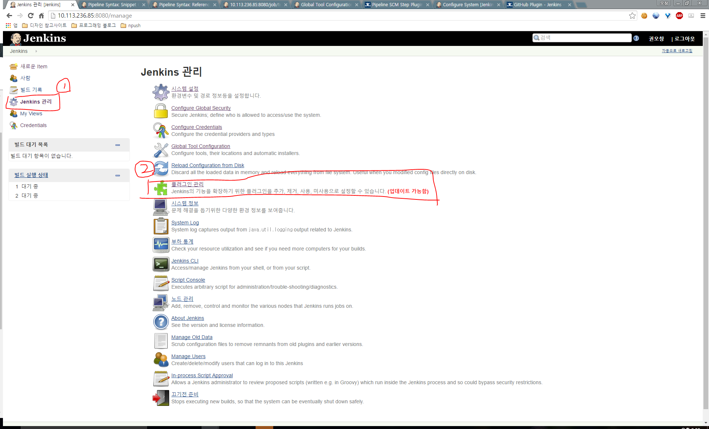
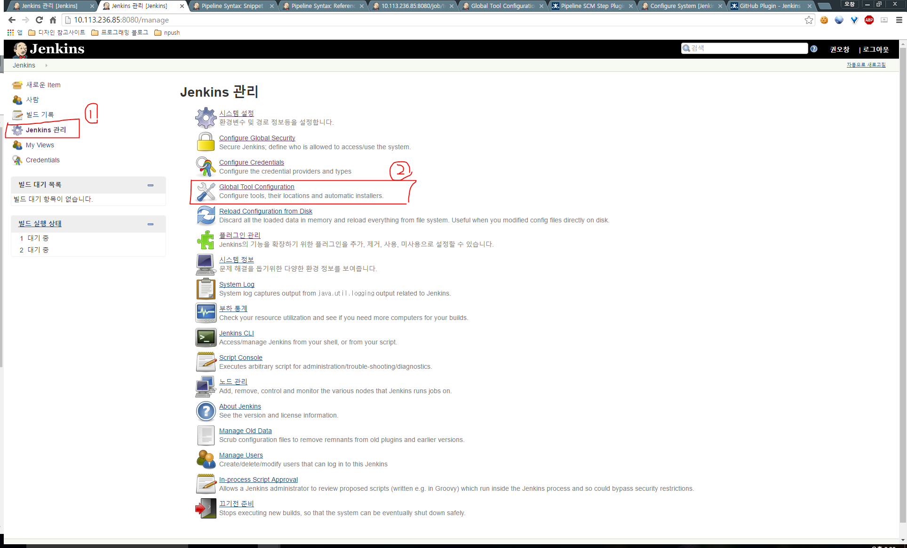
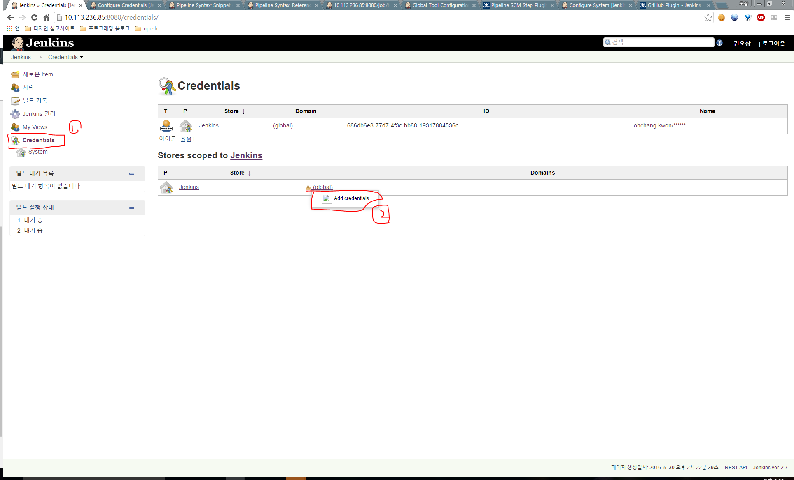
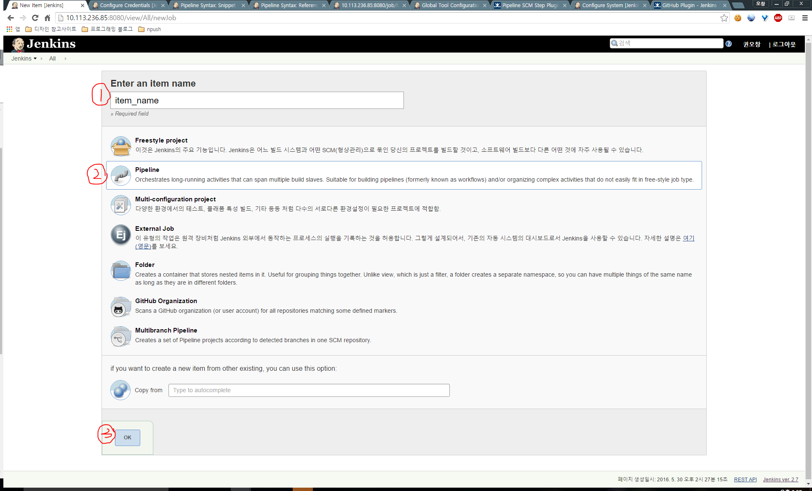
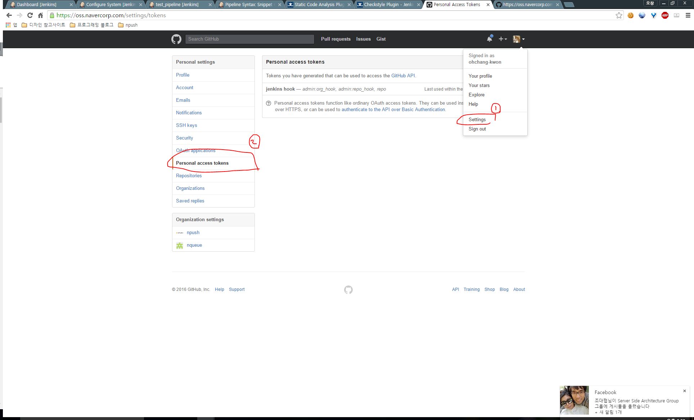
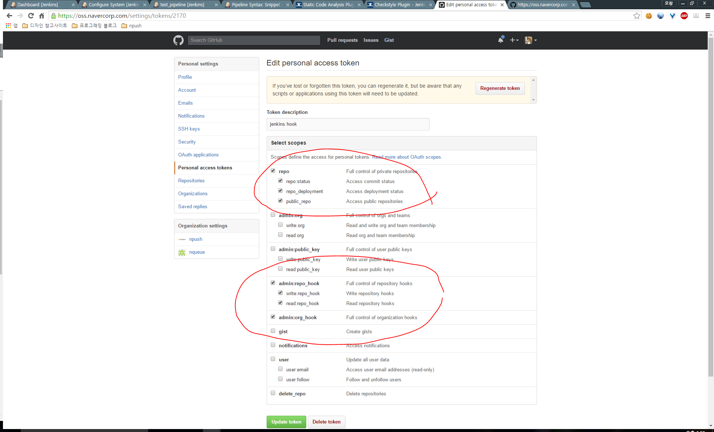
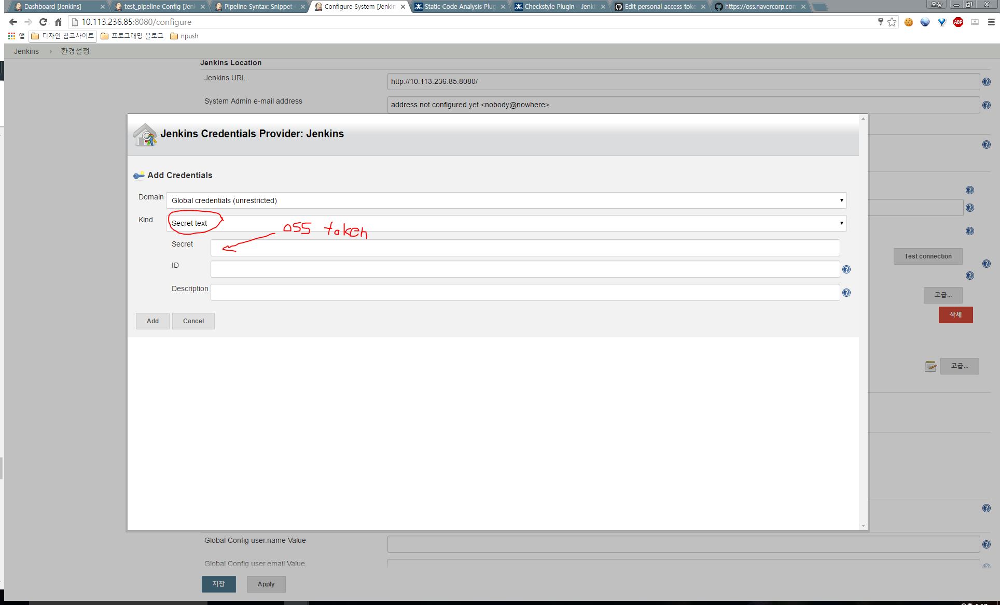
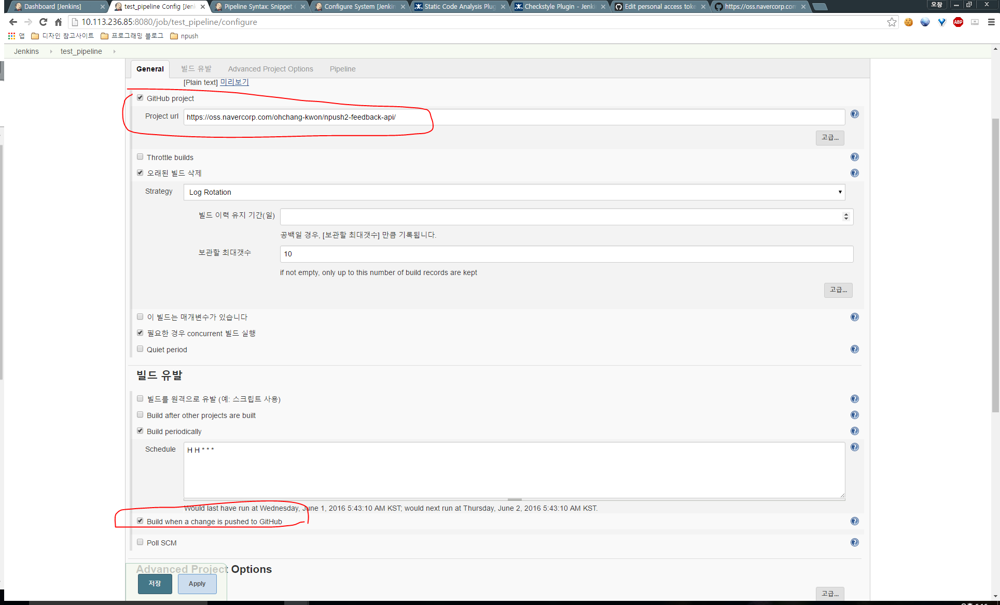
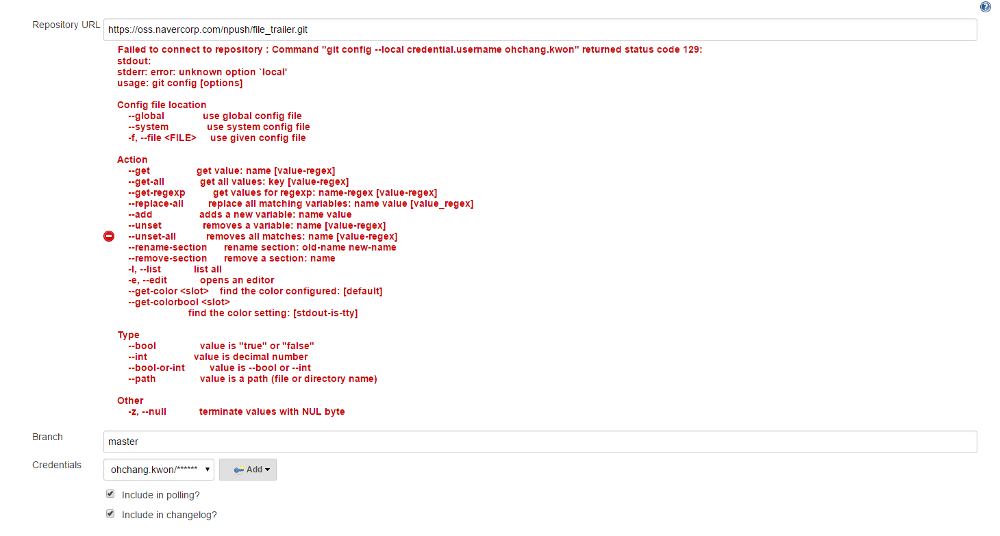

# 설정
## 젠킨스 설치
- centOS 설치 방법 : https://wiki.jenkins-ci.org/display/JENKINS/Installing+Jenkins+on+Red+Hat+distributions
- Jenkins 관련 기본 설정들은 `/etc/sysconfig/jenkins` 에 존재

## 젠킨스 플러그인 설치
- 젠킨스 default 포트는 8080

- Credentials Plugin
- Git plugin
- Pipeline*

## Global Tool Configuration 설정


### JDK 세팅

### Maven 세팅

### git 세팅


## Configure Credentials

### git Credential 추가


## 파이프라인 생성



## Github 연동
- [Github Plugin](https://wiki.jenkins-ci.org/display/JENKINS/GitHub+Plugin) 필요

### Github 계정 Token 생성



### Github plugin 설정




### 프로젝트 설정


## 테스트
- [JUnit Plugin](https://wiki.jenkins-ci.org/display/JENKINS/JUnit+Plugin) 필요
- `Publish JUnit test result report` Build Step 실행

## 정적 검사
- [Static Code Analysis Plug-ins](https://wiki.jenkins-ci.org/display/JENKINS/Static+Code+Analysis+Plug-ins) 필요
- [Dashboard View](https://wiki.jenkins-ci.org/display/JENKINS/Dashboard+View) 선택

## 배포
- 생략

### Groovy pipeline script
```groovy
node {
  // JDK 8 사용하도록 설정하기
  stage 'Setting'
  def javaHome = tool name: 'jdk8', type: 'hudson.model.JDK'
  env.JAVA_HOME = "${javaHome}"
  env.PATH = "${env.PATH}:${env.JAVA_HOME}/bin"

  // github에서 소스 얻어오기
  stage 'Checkout'
  git branch: 'development', credentialsId: '{your credential id}', url: '{your git url}'

  // Maven으로 빌드 실행하기
  stage 'Build'
  def mvnHome = tool 'M3'
  sh "${mvnHome}/bin/mvn -P local -Dmaven.test.skip=true -Ddeploy-path=./deploy clean install"
  
  // 테스트 진행하기
  stage 'Test'
  sh "${mvnHome}/bin/mvn -P local -B -Dmaven.test.failure.ignore verify"
  step([$class: 'JUnitResultArchiver', testResults: '**/target/surefire-reports/TEST-*.xml'])
  
  // 정적 검사 수행
  stage 'Analysis'
  sh "${mvnHome}/bin/mvn site"
  step([$class: 'CheckStylePublisher', canComputeNew: false, defaultEncoding: '', healthy: '', pattern: '**/checkstyle-result.xml', unHealthy: ''])
  step([$class: 'FindBugsPublisher', canComputeNew: false, defaultEncoding: '', excludePattern: '', healthy: '', includePattern: '', pattern: '**/findbugsXml.xml', unHealthy: ''])
  step([$class: 'PmdPublisher', canComputeNew: false, defaultEncoding: '', healthy: '', pattern: '**/pmd.xml', unHealthy: ''])
  
  // 패키지 저장
  step([$class: 'ArtifactArchiver', artifacts: '**/target/*.jar', fingerprint: true])
}
```

# 이슈
## git 접속 실패

- git 버전 1.7.13 이상부터 `--local` 옵션을 지원하기 때문에 발생하는 문제
- CentOS 기본 repository에서 2016.5.30 현재 기준으로 1.7.1이 설치된다
- https://git-scm.com/book/en/v2/Getting-Started-Installing-Git 참고해서 최신으로 설치해야함
	- 이미 구버전 git이 깔려있는 상황에서는 이렇게 하면 됨
	- `sudo yum install epel-release`
	- `sudo yum install curl-devel expat-devel gettext-devel openssl-devel perl-devel zlib-devel`
	- `git clone https://git.kernel.org/pub/scm/git/git.git`
	- 생성된 클론 디렉토리로 이동해서 `make configure`
	- `./configure --prefix=/usr`
	- `sudo make install`
	- `git --version` 1.7.13 이상인지 확인

## Github Push 연동 실패
### URL 문제

- Item 설정에서 GitHub project 하위 Project url을 다시 재확인
  - https://oss.navercorp.com/ohchang-kwon/npush2-feedback-api.git 처럼 끝에 .git이 붙으면 안 된다.
  - https://oss.navercorp.com/ohchang-kwon/npush2-feedback-api/tree/development 처럼 뒤쪽에 branch 관련 Path가 있어도 안 된다.

### 토큰 변경, 잡 변경 등으로 인한 문제

다시 GitHub 설정으로 가서 고급... 버튼을 누르면 추가로 나타나는 옵션 중 위 사진의 버튼을 눌러서 다시 Hook을 등록 시도 해보면 됨.