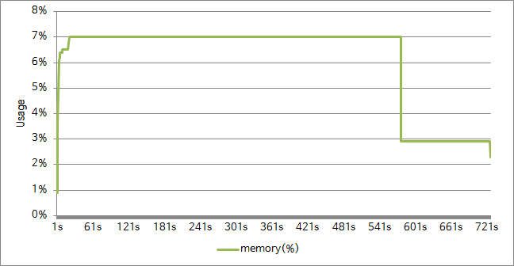
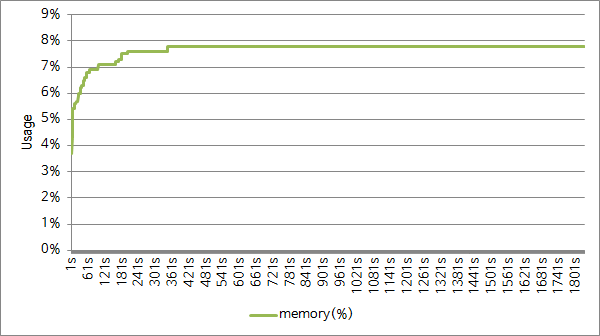
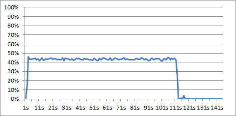
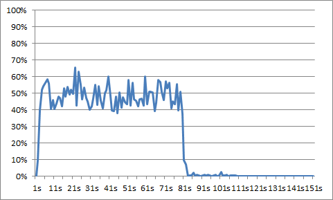
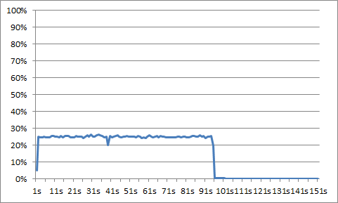
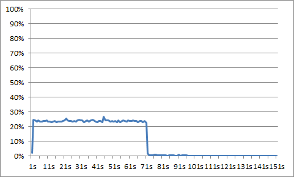

# Logstash

입출력 도구. input plugin을 통해 받은 데이터를 주어진 filter를 통과시켜 필요한 형태로 가공하고 주어진 output plugin을 향해서 내보냄.

## Inputs
* file - 파일시스템에 저장된 파일로부터 읽어옴. 읽어오는 형태는 UNIX `tail -0F` 의 결과물과 같음.
* syslog - 보통 514번 포트로부터 들어오는 syslog 메세지들을 받아 RFC3164 형식으로 파싱함.
* redis - redis lists와 redis channels을 사용해서 redis server로부터 읽어올 수 있음.
* beats - Filebeat가 전송한 이벤트들.

이 외에도 http, jdbc, log4j, s3, tcp 등 다양한 Input들이 존재함.

## Filters
* grok - 임의의 구조화된 텍스트로 파싱. 구조화되어 있지 않은 로그 데이터를 파싱할 때 Logstash에서 현재 사용할 수 있는 가장 최선의 방법
* mutate - rename, remove, replace 등 일반적인 편집을 수행
* drop - 완전히 삭제
* clone - 복제본을 생성. 필드를 추가하거나 제거하는 것도 가능.
* geoip - geo data, ip 주소 등 추가

## Outputs
* elasticsearch
* file
* graphite
* statsd

## Codecs
메세지를 손쉽게 구분하고, 전송할 수 있도록 도와주는 일종의 stream filters
* json
* msgpack
* plain (text)
* multiline - java exception이나 stacktrace처럼 여러 줄로 이루어진 로그를 하나의 메시지로 취급하기 위한 코덱

## Fault Tolerance
기본적으로 모든 과정이 메인 메모리상에서 일어나기 때문에 강제 종료나 프로세스 크래쉬 등의 사태가 벌어지면 데이터를 잃어버리게 된다. 그러나 SIGTERM 등 시그널을 받아 종료하게 되면 input을 먼저 종료하고 모든 output 과정이 끝날 때까지 잠시 대기하도록 한다. 그러나 만약 output의 대상이 접속이 불가능한 database인 등의 사태가 발생하게 되면, SIGTERM 을 받고도 무한히 대기하게 될 수도 있다.

## Execution Model

Input Threads + Worker Threads
Synchronous Queue에서는 이벤트를 즉각적으로 비어있는 워커 쓰레드로 보내는 역할. 만약 모든 워커 쓰레드가 바쁜 상황이라면 가능해질 때까지 작업을 중지함.
Worker Thread에서 Filter, Output 작업 수행

파이프라인 설정
1. *--pipeline-workers* - 쓰레드 갯수 지정
2. *--pipeline-batch-size* - 각 워커 쓰레드가 한번에 가져갈 수 있는 이벤트의 최대 양 지정
3. *--pipeline-batch-delay* - 이벤트를 받아서 처리하는 사이의 시간 지정

# Beats
다양한 종류의 데이터들을 서버에서 다른 곳으로 전송하기 위한 open source 프로그램


대표적인 종류는 다음과 같음
* Packetbeat - 어플리케이션 서버에서 교환되는 각종 트랜잭션의 정보를 전송하는 네트워크 패킷 분석기
* Topbeat - 주기적으로 시스템 여러 데이터들과 각 프로세스 통계 데이터를 전송하는 서버 모니터링 도구
* Filebeat - 주로 로그파일을 전송하는데 사용하는 파일 수집 도구


## Filebeat

### 설치 방법

1. Public Signing Key, Repository 등록
[Ubuntu]
```bash
# Key 등록
curl https://packages.elasticsearch.org/GPG-KEY-elasticsearch | sudo apt-key add -
# Repository 추가
echo "deb https://packages.elastic.co/beats/apt stable main" |  sudo tee -a /etc/apt/sources.list.d/beats.list
```
[CentOS]
```bash
# Key 등록
sudo rpm --import https://packages.elastic.co/GPG-KEY-elasticsearch
# Repository 추가
echo -e '[beats]\nname=Elastic Beats Repository\nbaseurl=https://packages.elastic.co/beats/yum/el/$basearch\nenabled=1\ngpgkey=https://packages.elastic.co/GPG-KEY-elasticsearch\ngpgcheck=1' | sudo tee /etc/yum.repos.d/beats.repo
```
2. filebeat 설치
[Ubuntu]
```bash
sudo apt-get update && sudo apt-get install filebeat
# 부팅과 함께 실행되도록 하려면 추가
sudo update-rc.d filebeat defaults 95 10
```
[CentOS]
```bash
sudo yum install filebeat
# 부팅과 함께 실행되도록 하려면 추가
sudo chkconfig --add filebeat
```

### 요구사항
**1. 여러 임의의 이름을 가진 로그 파일이 있을 때, 모든 파일의 내용을 output으로 보낼 수 있어야 함.**
-> 여러 개의 Path를 등록할 수 있음.
```
filebeat:
	prospectors:
		path:
			- /logs/
			- /var/logs/
	prospectors:
		path:
			- /home/naver/logs/
```
-> 와일드카드를 사용해서 특정 유형의 이름을 가진 파일들을 모두 읽도록 할 수 있음.
```
filebeat:
	prospectors:
		path:
			- /logs/*.log*
```
-> 정규식을 사용해서 제외할 파일 이름 형식을 등록할 수 있고, scan_frequency 옵션 값을 조절하여 앞서 지정한 path를 탐색하는 주기를 조절하는 것도 가능.
```
filebeat:
	prospectors:
		exclude_files: ["^."]
		scan_frequency: 5s
```

**2. filebeat가 어떠한 원인으로 내려갔다가 다시 올라왔을 때, 기존의 위치를 다시 찾아서 읽을 수 있어야함.**
-> 1부터 계속해서 1씩 증가하면서 로그 파일에 쓰는 스크립트를 간단하게 작성하여 실행
-> 아웃풋에 어디까지 나와있는지 확인
-> kill -9 명령어로 filebeat 강제종료 후 다시 실행하여 중복되는 숫자 없이 아웃풋에 기록되는지 확인
-> 문제 없이 뒤이어 읽는 것을 확인 가능

**3. 파일 크기에 관계 없이 부하가 크지 않아야 함.**
-> 100메가급 대용량 로그 파일 10개, 이후 1메가급 소용량 파일 1000개 테스트. 테스트한 pc의 메모리는 총 489MB, ignore_old값을 1m으로 주어 다 읽고난 파일은 release
-> 100MB 10개 


-> 1줄짜리 1000개


-> 파일 크기, 양에 따라 메모리 사용량이 증가. 해당 테스트에서는 많아도 30~40MB 전후로 사용됨.

**4. file descriptor 관련 메모리 누수가 발생하지 않아야 함.**
-> filebeat는 파일을 읽기 상태로 열어서 유지
-> 파일 삭제, 수정이 불가능해지고 메모리를 지속적으로 점유함


* 해결책
	1. force_close_files - 데이터의 손실 및 파일 레지스트리 정보를 잃을 수 있음
	2. ignore_older - filebeat가 오래 종료되어 있었을 때 새롭게 생겨난 피드백 파일을 인식하지 못할 수 있음

**5. log rolling을 할 때, 파일 이름이 계속 바뀌게 되는데 새로운 파일로 인식하지 말아야 함.**
-> filebeat가 파일을 이미 읽은 상태에서 파일 이름을 변경하여 같은 내용이 아웃풋에 쌓이는지 확인
-> filebeat가 열고 있는 상황에서는 파일의 변경, 삭제가 불가능. (Text busy file)
-> ignore_older을 짧게(1s)로 설정하여 변경 가능하게끔 만듬
-> 파일 이름을 변경하고, `echo "test line" >> ./ignored_log_file.log` 등을 통해 테스트 해본 결과 ignore 되었던 파일의 이름이 수정되더라도 변경된 부분만 인식하는 걸 확인.

**6. filebeat에서 파일을 읽고 있을 때, log rolling이 정상적으로 일어날 수 있어야 함.**
-> 테스트 log4j rolling property MaxFileSize=5KB, MaxBackupIndex=5
-> 정상적인 상황

-> filebeat를 실행해놓은 상황
~~-> filebeat에서 파일을 읽고 있을 때에는 log4j의 log rolling이 정상적으로 일어나지 않고, 기존의 파일에다가 계속해서 써넣는 것을 확인할 수 있음.~~

### 문제점
~~**1. filebeat를 실행해놓은 상태에선 파일을 계속 read모드로 열어두기 때문에 rename이 불가능하고 그에 따라 log rolling이 불가능함**~~
> vm환경에서 windows와 directory를 공유해놓은 상황이었기 때문에 생긴 문제

|대응|한계|
|-------|----|
|ignore_older 옵션을 짧은 값으로 설정|데이터가 빠른 속도로 쌓이고 있는 상황에서 rollover까지는 성공하되 rename에서 실패하여 결국 같은 파일에 로그가 쌓이는 현상을 확인할 수 있었음.|
|path에서 rolling된 파일 이름만을 인식하도록 설정|rolling에 걸리는 시간만큼 피드백 반영에 지연이 생기며, 또 rolling이 일어나지 않을 경우 데이터가 손실될 위험도 있음. 그에 따라 log 설정을 만져줘야 하는 한계점도 존재.|

**2. 큰 파일이 여러개 존재하는 경우 CPU 자원을 지나치게 많이 소비함. 쓰로틀링을 거는 방법도 존재하지 않음.**

### 대안 비교

||filebeat|node.js|java|linux tail|
|---|---------|------|----|-----------|
|파일 감시|directory 통째로, 일부 파일 와일드카드, 정규식 사용해서 감시하는 것이 가능|fs라이브러리를 사용해서 감시 가능|WatchService 사용해서 감시 가능|불가능|
|로그 롤링|기본적으로 파일을 busy상태로 만들기 때문에 불가능. 문서대로 ignore_older 값을 설정하더라도 tps가 높아지면 제대로 롤링이 이루어지지 않음.|파일을 read상태로 감시하는 것이 아니므로 문제 없음.|node.js와 동일|filebeat와 마찬가지로 불가능|
|쓰로틀링|자체적으로 지원하지 않음|구현 가능|구현 가능|자체적으로 지원하지 않음|
|언어|GO|Javascript|Java|C|
|특징|ignore상태의 파일 이름을 바꿨을 때, 정상적으로 작동하지 않는 이슈가 추가적으로 있음.|생산성이 뛰어남|안정적이고 사내에서 주로 사용되는 언어||

### node.js 삽질

filebeat가 가진 여러 한계 때문에 다른 모듈을 찾아다니다가, [Log.io](https://github.com/NarrativeScience/Log.io) 의 코드를 보니 생각보다 간단하였음. 이 정도면 직접 구현해도 오래 걸리지 않을 것이라 판단되어 filebeat와 log.io, 그리고 node-tail 코드를 참고해가면서 새로 작성.

1. 파일을 즉시 처리할 필요가 없기 때문에 파일을 하나씩만 보도록 코드 작성.
-> 그럼에도 불구하고 cpu점유율이 높음
-> file input stream을 읽어올 때, interval로 읽어오도록 하여 큰 파일을 읽을 때 cpu점유율을 낮춤
-> 상대적으로 파일 처리하는 속도는 느려짐
2. 파일이 빠르게 수정될 때, cpu 점유율이 큰 폭으로 상승함
-> 이벤트가 발생할 때마다 fs.stat을 호출하여 파일 stat을 받아오는데 이 과정에서 병목이 일어나는 것으로 판단됨
-> fs.watch을 써서 watch 관련 이벤트가 발생할 때마다 처리하는 것에서 setInterval로 지정된 기간마다 한번씩 directory을 탐색하도록 하여 해결
3. Registrar.writeRegistryFile에서 사용하는 fs.writeFile에 memory allocate 에러 발생
-> fs.writeFile 대신에 fs.createWriteStream으로 stream을 만들어서 거기에 쓰도록 변경
-> Registry가 하나만 유지되어야하는데 stream 특성상 계속해서 이어 써내려가는 문제가 있음
-> 다시 fs.writeFile을 쓰되 사이에 Queue를 하나 놓고 순차적으로 파일에 쓰도록 변경

### filebeat cpu, line size에 따른 테스트

**vCPU 4EA, Memory 8GB
CentOS 6.7 64bit
filebeat 1.1.1**

|output| 1kb | 2kb |
|------|-----|-----|
|console||
|file|||

**vCPU 8EA, Memory 16GB
CentOS 6.7 64bit
filebeat 1.1.1**

|output| 1kb | 2kb |
|------|-----|-----|
|console|||
|file|||

**CPU의 성능이 올라가도 비교적 비슷한 시간 내에서 더 적은 cpu점유율을 보이는 것으로 보아 자체적으로 cpu 사용량에 대한 한계치가 있음을 확인할 수 있음.
같은 크기의 파일이지만 각 line이 2kb인 파일이 1kb인 파일에 비해서 절반정도의 시간이 걸리는 것으로 보아 line의 size보단 count가 더 큰 영향을 보이는 것도 확인 가능.**